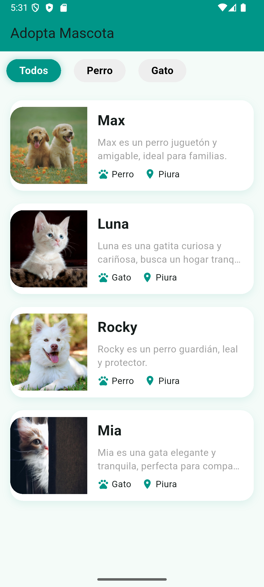
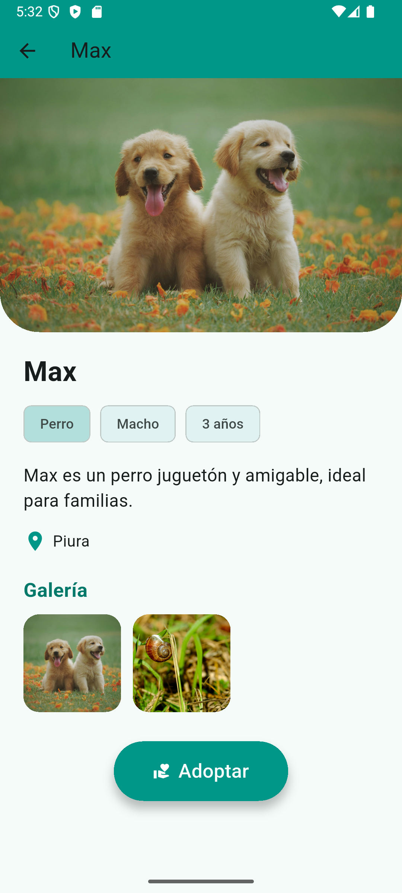

# 🐾 Adopta Mascota VB

Aplicación Flutter profesional para listar, explorar y adoptar mascotas, desarrollada con Clean Architecture y Provider.

---

## 🚀 Características

- Listado de mascotas por categorías (Perro, Gato, Todos)
- Filtros animados y cards modernas
- Pantalla de detalle con galería, información completa y botón de adopción
- Imágenes reales de mascotas
- Arquitectura Clean: Presentation, Domain, Data
- Simulación de API local (puedes conectar con tu backend fácilmente)
- Animaciones y UI atractiva

## 📸 Capturas de pantalla

<p align="center">
  
  
</p>

## 🗂️ Estructura del proyecto

- `lib/domain`: Entidades, repositorios y casos de uso
- `lib/data`: Datasources y repositorios
- `lib/presentation`: Providers y páginas (UI)

## ▶️ Ejecución

1. Instala dependencias:
   ```bash
   flutter pub get
   ```
2. Ejecuta la app:
   ```bash
   flutter run
   ```

## 🎨 Personalización

- Puedes agregar más categorías, mascotas o conectar con una API real editando `pet_api_datasource.dart`.
- El diseño es fácilmente escalable y personalizable.

## 👤 Autor

GIAN SANDOVAL

<hr>
<h2 align="center">🌐 Conecta conmigo</h2>
<p align="center">
  <a href="https://www.youtube.com/@flutteres" target="_blank"></a>
  <a href="https://www.tiktok.com/@flutter_es?lang=es" target="_blank"></a>
  <a href="https://www.instagram.com/giansando5/" target="_blank"></a>
  <a href="https://www.linkedin.com/in/giansandoval/" target="_blank"></a>
  <a href="mailto:giansando2022@gmail.com" target="_blank"></a>
  <a href="https://www.facebook.com/giansando7/" target="_blank"></a>
</p>

---
¡Listo para adoptar y explorar mascotas con la mejor experiencia Flutter!
